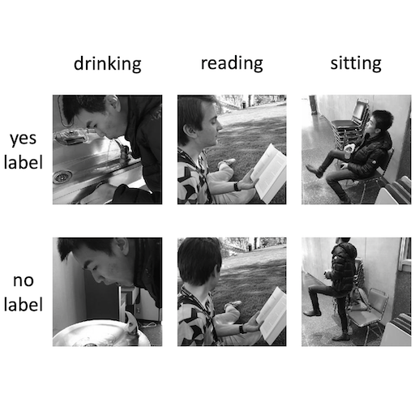

## Subtle Binary Activities dataset

- People appearing in the photographs of the _training_, _validation_ or _test_ sets are uniquely present in one set. For example, if one person is in the _training_ set, then that person is not present in either the _validation_ or _test_ set. 

- We made our _test_, _train_ and _validation_ splits as unbiased as we could. Other splits can be constituted but be aware that image splits can influence performance more than algorithmic implementations. Assigning the photographed person to a unique split is a good way to work with less-biased data. 

- In a few pictures of the _drinking_ and _sitting_ dataset, the subject is an animal, not a human. 

  
  
Example of grayscale images from our datasets.

