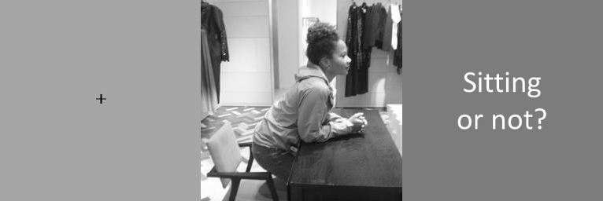

Uses the [psiTurk](https://psiturk.org/) environment.

Participants are presented a gif consisting of a fixation cross during 500 ms, an image and finally a question. The image is presented during either 50, 150, 400 or 800 ms.

  
  
Layout of an example gif.

